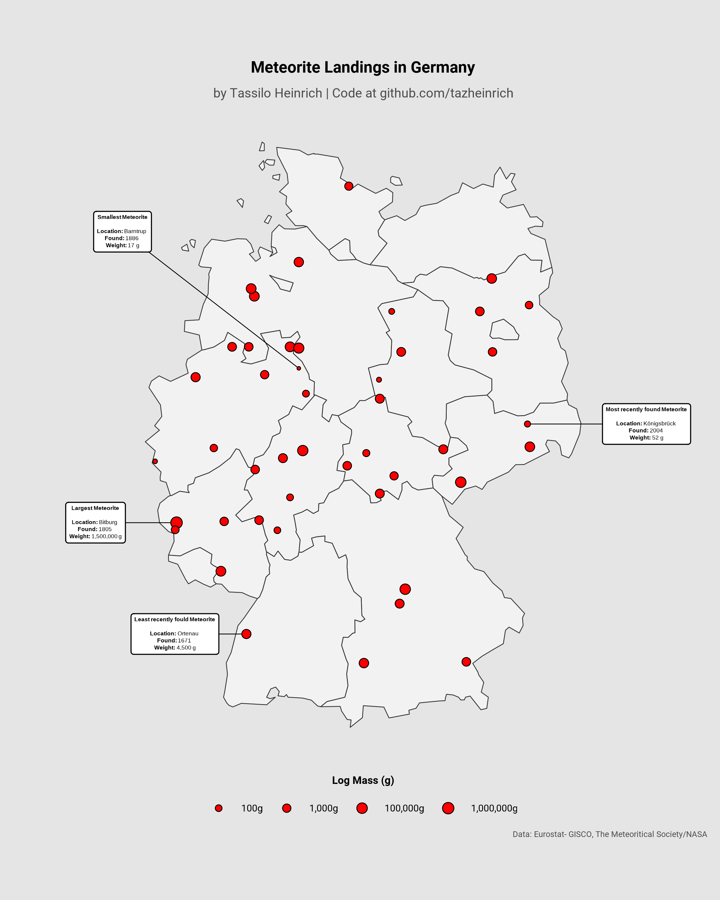

# 30 Day Map Challenge 2024

This repository documents my contributions to the [#30DayMapChallenge 2024](https://30daymapchallenge.com/).

## Prerequisites for Reproducibility

All plots are done using the statistical programming language [R](https://cran.r-progject.org/) in combination with the plotting package [ggplot2](https://ggplot2.tidyverse.org/). The respository is designed with reproducibility in mind and further prerequistes for seamless reproduction of the plots will be added soon to this README.

## 01 Points: Meteorite Landings in Germany

For the first challenge, meteorite landings are plotted as points on a map of Germany. The data for the meteorite landings is from [The Meteoritical Society](https://meteoritical.org/), accessible at [NASA's Open Data Portal](https://data.nasa.gov/Space-Science/Meteorite-Landings/gh4g-9sfh/about_data). Only observations are used, which contain information about mass and location of the landing. The shapefile for Germany is retrieved from [Eurostat - GISCO](https://ec.europa.eu/eurostat/web/gisco/) by the [gisco-package](https://ropengov.github.io/giscoR/).

